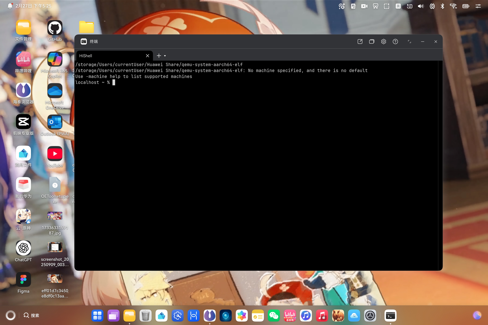
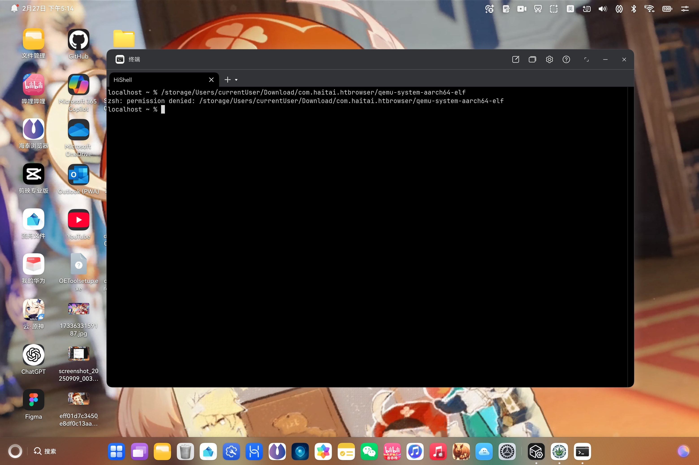

# 加了HMV（华为鸿蒙虚拟化后端）支持了的QEMU
这个是我们研究了鸿蒙的Hypervisor的这个架构 然后去适配QEMU的库
## 为啥
自从鸿蒙电脑发售 [冖糇](https://notebooklm.google.com/notebook/c78caf29-28b5-4b50-8b5a-8c72c49a8845)们都在嘲笑 鸿蒙电脑干不了大事 华为自己要求其他厂商套的壳一堆稀烂 App不能透传啊 音乐显示不到这个播控中心啊 鸿蒙碰一碰没办法直接碰到虚拟机啊 跨设备拖拽没办法放到鸿蒙里面啊 虚拟机调用不了附近我的**HUAWEI Mate X7**来去拍照扫描啊 根本没有给OneDrive做适配啊 一大堆 如果我说[卓易通](https://droitong.com)是神 虽然是说 调用文件还是调用的是安卓容器里面的文件Picker 但是他至少做到了和鸿蒙不割裂啊 鸿蒙电脑的性能其实很强 华为的HMV其实也很强 只是说生态差了点意思 你总不能说叫我用累总抄袭微软做的WPS吧 何况我OneDrive里面差不多半个T的资料 我怎么可能放弃OneDrive M365 Suite和Apple Music 换用累总的W 呕 WP 呕 那个早期和微软签订了合作协议的WPS然后微软被累总恶心到了就单方面撕毁协议的WPS吧 再加上 很多工具 比如说Cursor啊 Antigravity啊 Codex啊 Claude Code啊这些 他们这几年都不会适配鸿蒙对吧 这就很有点麻烦了 所以说 做一个生态融合的虚拟机就很有用
基于虚拟化社区的首选 [QEMU](https://www.qemu.org/)就成了我们的改造方向 我们扒开了鸿蒙内核的虚拟化文件（**hypervisor.h**）其实 他们是留了一个叫做HMV的虚拟化框架的 类似苹果HVF和VF 以及大家都有所耳闻的**KVM** 他在底层的具体入口 其实也就是一个名为 /dev/hmv 的设备节点 但是呢 我们照着这个**hypervisor.h**的 往下翻 怎么这么类似KVM呢：
```c
//华为版 (HMV)
#define HMV_NEW_VCPU __HMV_IOWR(HMVIO, 0, struct __hmv_new_vcpu)
#define HMV_NEW_VM __HMV_IOWR(HMVIO, 2, struct __hmv_new_vm)
#define HMV_REGISTER_REGION __HMV_IOW(HMVIO, 4, struct __hmv_register_region)
#define HYP_VCPU_START 10
#define HYP_VCPU_SETREG 3
#define HYP_VCPU_GETREG 2
```

```c
//Linux经典版 (KVM) 对比参考
#define KVM_CREATE_VCPU       _IO(KVMIO,   0x41)
#define KVM_CREATE_VM         _IO(KVMIO,   0x01)
#define KVM_SET_USER_MEMORY_REGION _IOW(KVMIO, 0x46, ...)
#define KVM_RUN               _IO(KVMIO,   0x80)
#define KVM_SET_REGS          _IOW(KVMIO,  0x82, ...)
#define KVM_GET_REGS          _IOR(KVMIO,  0x81, ...)
```

这哪里是“类似” 这简直是失散多年的亲兄弟啊 甚至在咱们翻开的内核头文件里 赫然写着一句极其“坦诚”的官方注释：
> `/* We use kvm magic in order to not conflict with other ioctl cmds from linux */` 
> `#define HMVIO 0xAE`

**连 Magic Number 都为了避开冲突而特别设计 这套底层 UAPI 接口的设计 可以说是把 KVM 的通用性精髓给全盘继承了！**

OK 既然这么相像的话 我们就可以直接大胆的拿来做适配了 于是乎 我们就有了
## 做法
在QEMU这种极其重的工业级软件里 要想从零手搓一个全新的加速后端 那难度简直是徒手造光刻机 比如说 你得要搞懂内存读写啊 和上层鸿蒙系统交流 欸 那啥 给我开几块虚拟CPU 模拟显卡声卡网卡啊之类的 还要处理各种中断和异常 简直是头大 还要分条件看`exit()`是为啥要**exit**啊 要安抚机魂 但既然HMV的指令逻辑和KVM如此通用 咱们完全可以照着`accel/kvm/kvm-all.c`的架构图纸 上演一出史诗级的“换皮大业”：

*   **第一步：启动虚拟机实例**：人家KVM是`KVM_CREATE_VM` 我们这边就用 `HMV_NEW_VM` 去向 `/dev/hmv` 申请创建一个新的虚拟机实例 把控制内核的句柄稳稳拿在手里
*   **第二步：创建虚拟CPU核心**：KVM兴说`KVM_CREATE_VCPU` 我们这边换一下 就是`HMV_NEW_VCPU` 对 用它在虚拟机引擎里把虚拟CPU核心给捏一个出来
*   **第三步：做内存映射**：内存映射是虚拟化的命脉 就像西方不能**失去耶路撒冷** 就像麒麟X90不能失去**终端** 就像问界M9不能失去**ADS智驾** 那啥 友商KVM靠`KVM_SET_USER_MEMORY_REGION`同步页表 咱们就借鉴一下 用`HMV_REGISTER_REGION`把来宾的那个物理地址（GPA）和宿主的虚拟地址（HVA）死死绑在一起 让底层硬件自己去通过Stage 2页表做地址转换 直接跑出原生的极限速度 我看你这次还跑不快 跑不快就代表着余总叫着两个SELinux保安去来抓我们了 快跑
*   **第四步：HMV 启动！**：在vCPU的主线程里 KVM 是疯狂调用`ioctl(KVM_RUN) `咱们就换成疯狂调用`HYP_VCPU_START`这一脚油门踩下去 宿主机的物理CPU就会乖乖切入Guest模式开始狂奔
*   **第五步：处理 VM Exit**：当虚拟机玩的正嗨的时候摸了**不该摸的东西** 比如**MMIO读写**或者**发起特权呼叫** 物理CPU立刻罢工 触发*VMExit* 此时鸿蒙*HMV*的**黑魔法**来了 也是我们**加了HMV前端支持了的QEMU**要做的事 对于高频的MMIO等外设访问 HMV呢 他就嫌弃同步阻塞太慢 根本不会傻等**HYP_VCPU_START指令**返回 而是直接通过激活池和*Upcall*机制 像电击一样 异步精准调用QEMU提前绑定的actvhdlr处理函数 至于遇到HLT休眠或者HVC这种特权呼叫 当**HYP_VCPU_START**真正同步返回时 QEMU才需要去读取__vmexit_info结构体里面的exit_event字段 来判断这故障码到底是休眠还是特权请求 然后QEMU大管家就赶紧模拟外设响应 给内核返回**__ACTV_WFERET_HYP_VMEXIT_OK**生死状或者**强行给Guest注入虚拟中断**把系统电醒
## 效果
本来应该是这样：

但是事与愿违 余总啊 那个啥 你别搞你那个鸿蒙智行了 过来看看你为啥给我一脚把我踹飞了 我是花粉啊 你为啥叫SELinux直接一脚踹飞出鸿蒙系统呢：

如果大佬们有不受SELinux和鸿蒙星盾安全架构管控的设备 可以Fork下来编译下试试看
## 如何编译
这么做
```bash
git clone https://github.com/AetheriumSimulator/qemu-with-hmv-support.git
cd /path/to/this/project
bash build_hmos.sh
# 然后等一下他 看看她啥时候编译完
```
## 总结
通过这种“换皮不换骨”的策略 我们成功地让**QEMU**这个老牌的虚拟化引擎 给他安了个*鸿蒙座舱*和*华为ADS高阶智驾* **我们不造整车 我们帮助车企造好车** 实现了与鸿蒙Hypervisor的无缝对接 这样一来 我们不仅保留了QEMU在设备模拟和生态兼容方面的巨大优势 更重要的是 借助于HMV的硬件加速能力 极大地提升了虚拟机内的运行效率 真正做到了既要又要还要 既要生态又要性能 既要兼容又要速度 既要鸿蒙又要QEMU 既要... 算了 不说了 再说下去要被余总的SELinux保安抓去喝茶了
## 许可证
按照GNU GPL协议第二代限制 这个库也用GNU GPL V2 详细请看：[用户协议](LICENSE)
## 备注
原QEMU的Readme：[QEMU Readme](https://github.com/qemu/qemu/blob/master/README)
华为HMV的一些特殊机制：[上报](docs/hmv/upcall.md) 还有这个针对HMV需要的优化： [优化](docs/hmv/other-optimized-functions.md)